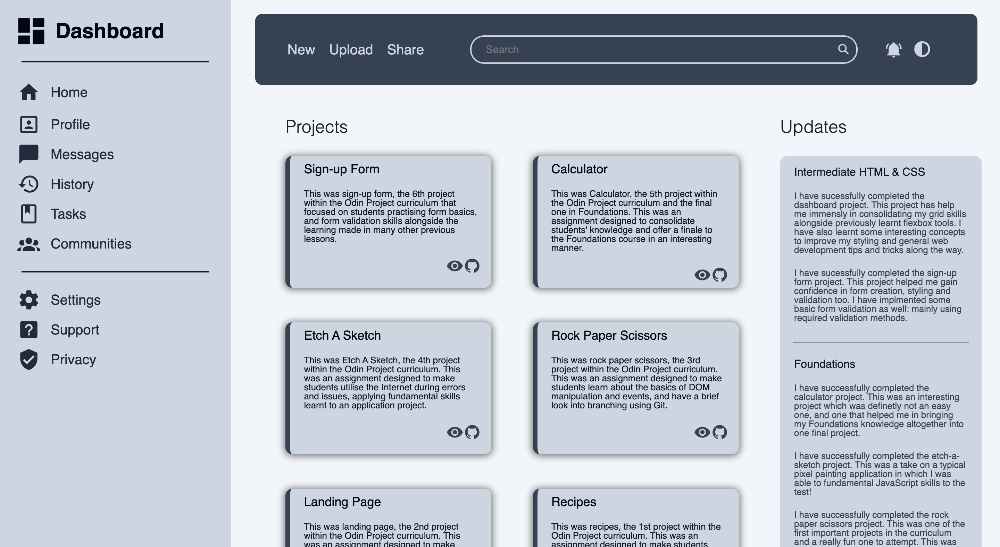
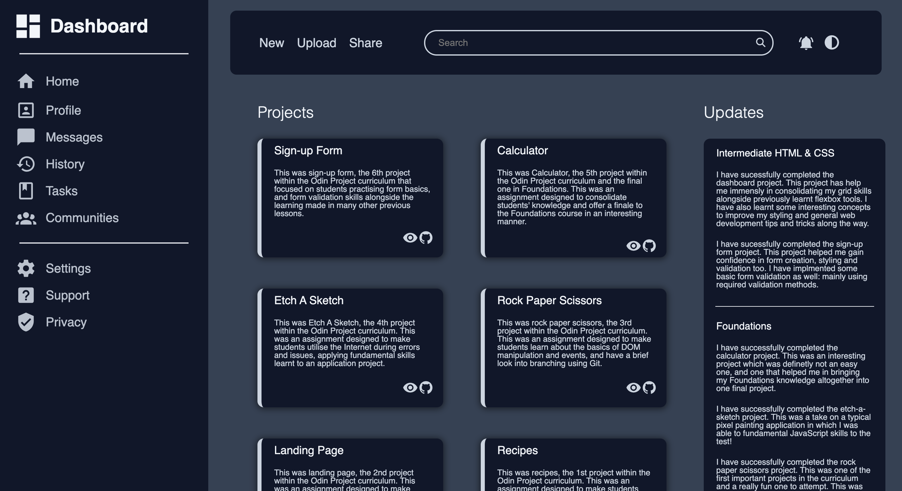

# Dashboard

This was the `dashboard` project, the [*7th project*](https://www.theodinproject.com/lessons/node-path-intermediate-html-and-css-admin-dashboard) within the Odin Project curriculum that made students recreate an entire webpage, provided a design, using various tools such as Grid and Flexbox learnt previously.

## Links

- [*Live Preview*](https://devvivan.github.io/odin-dashboard/)
- [*My Progress*](https://github.com/DevVivan/odin-project)

## What did this project teach me?

### HTML

- Creating forms
  - Form control elements
  - Form styling
  - Form validation

### CSS

- Layering using `z-index`
- Position properties in CSS
- Utilising custom properties
- Using a CSS reset
- Flexbox knowledge recap

## Images

https://devvivan.github.io/odin-dashboard/
